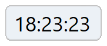
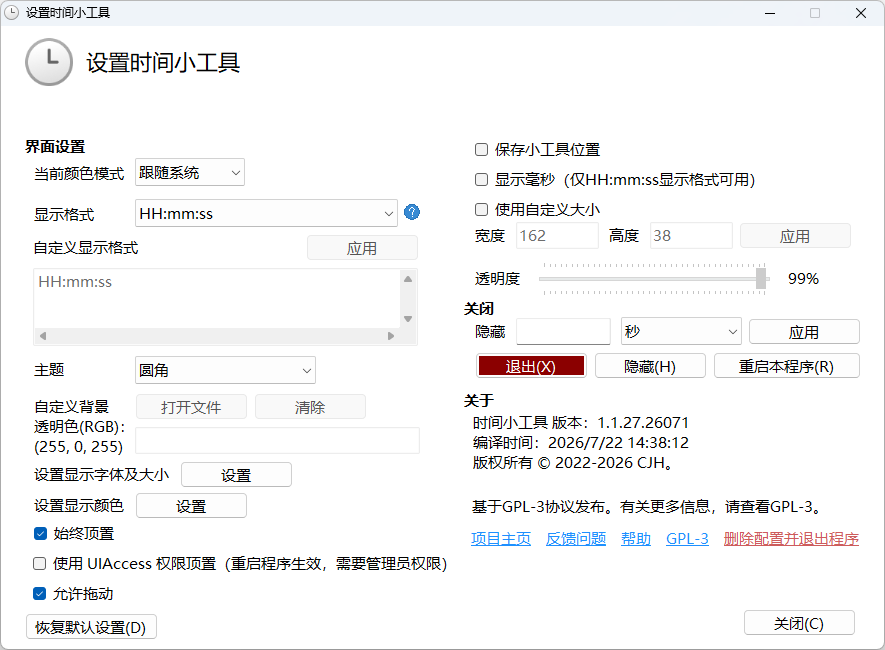

<h1 align="center">
  <a href="https://github.com/cjhdevact/TimeControl">TimeControl - 时间小工具</a>
</h1>

## 关于本项目

这是一个支持在电脑上随时查看当前时间的小工具。本软件可以安装在大屏上（例如教学大屏），也可以安装在普通电脑上。

## 功能

本程序支持的功能有：

- [x] 显示时间（基础功能）
- [x] 深浅色模式
- [x] 多种主题（可以自定义）
- [x] 自定义时间显示格式
- [x] 支持通过组策略配置策略
- [x] 支持保存你的设置
- [x] UIAccess 级别顶置（需要 Windows 8 以上版本）
- [x] 适配DPI缩放（适配高分屏）
- [x] 其它一些功能。它们正在等待被你发现……

补充说明：

- UIAccess 级别顶置功能需要 Windows 8 以上版本才可使用，Windows 7 及以下版本无需此功能支持。UIAccess 需要以管理员身份运行，本程序内部自动提权的功能在 Windows 8 默认自带的 .NET Framework 4.5 下可能会导致程序崩溃，建议升级 .NET Framework 4.6 及以上版本，或者手动以管理员身份运行。Windows 8 和 8.1 开机自启开始屏幕会覆盖住UAC窗口，导致开机自启UAC确认窗口最小化到任务栏，如果不确认UAC，操作程序会出现初始化Bug，建议关闭UAC提示使用。

- 本程序界面的圆角功能需要开启 DWM 渲染，如果你使用的是 Windows Vista 和 7，需要开启 Aero 主题，否则无法显示圆角效果，Windows XP 等无 DWM 渲染不支持显示圆角效果，Windows 8 以上的系统默认支持显示圆角效果。

## 下载

请访问[发布页](https://github.com/cjhdevact/TimeControl/releases/latest)下载最新版本的可执行文件或源代码。

早期版本亦可在发布页中找到。

## 数字签名

本项目发布的二进制文件使用自签名证书进行代码签名，以确保文件的完整性和来源可信。

证书信息：
```
Name: CJH Root Certificate
Create: ‎2024‎年‎12‎月‎27‎日 20:42:16
Expires: ‎2150‎年‎12‎月‎31‎日 0:00:00
MD5: 0bc507db70947e57ddd81bec63b581d9
SHA256: d2d67c8ebea3cc954c7ee0e94f5f45537dde7709053ca9e89f352fda60283
Key fingerprint (SHA1): 73b80a8d0ba3f662b575f2fc0b78612469e22e59
KeyID: d929e453f645017190dac5001a736a4d
Certificate SerialNumber: dbde77418068d5a34b2064626a12ecde
Key Type: md5RSA
```

如需验证，可从[这里](Src/TimeControl/files/rootcert.cer)获取根证书文件。

## 程序截图

主程序界面（浅色）



主程序界面（深色）


设置界面



## 相关项目

[CountDownControl](https://github.com/cjhdevact/CountDownControl) - 倒计时小工具，支持高度自定义的倒计时小工具

[TimeControlAero](https://github.com/cjhdevact/TimeControlAero) - 时间小工具Aero版（开发中）

## 致谢

本项目使用了以下第三方库：

[uiaccess](https://github.com/killtimer0/uiaccess)

## 开源说明

在修改和由本仓库代码衍生的代码中需要说明“基于 TimeControl 开发”。

本项目基于 `GPLv3` 许可证开源，详情请参阅 [License](License) 文件。 

您可以在遵守许可证的前提下自由使用、修改和分发本软件。