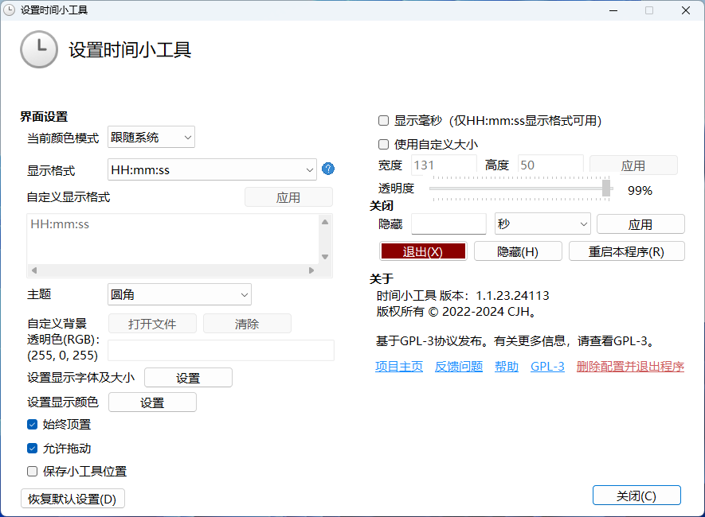

<h1 align="center">
  TimeControl - 时间小工具
</h1>

## 关于本项目

这是一个支持在电脑上随时查看当前时间的小工具。本软件可以安装在大屏上（例如教学大屏），也可以安装在普通电脑上。

## 功能

本程序支持的功能有：

- [x] 显示时间（基础功能）
- [x] 深浅色模式
- [x] 多种主题（可以自定义）
- [x] 自定义时间显示格式
- [x] 支持通过组策略配置策略
- [x] 支持保存你的设置
- [x] 其它一些功能。它们正在等待被你发现……

## 下载

转到[发布页](https://github.com/cjhdevact/TimeControl/releases)下载程序或源代码。

早期版本的源代码也在发布页里。

## 程序截图

主程序界面（浅色）

主程序界面（深色）

设置界面

## 开源说明

在修改和由本仓库代码衍生的代码中需要说明“基于 TimeControl 开发”

## 相关项目

[TimeControlAero](https://github.com/cjhdevact/TimeControlAero) - 时间小工具Aero版（开发中）

## 你知道吗？

本项目诞生于2022年12月份。开发本程序最初的目的是为了在上课时随时查看准确时间……

本程序的代码由于诞生于作者刚开始使用VB.net语言开发的时候，所以代码写的很乱，命名没有那么规范，且只有少量注释，如果要理解本程序的代码，请自己尝试一下……
~~重构本程序已经被提上了计划~~

------------

本程序基于 `GPL-3.0` 授权。